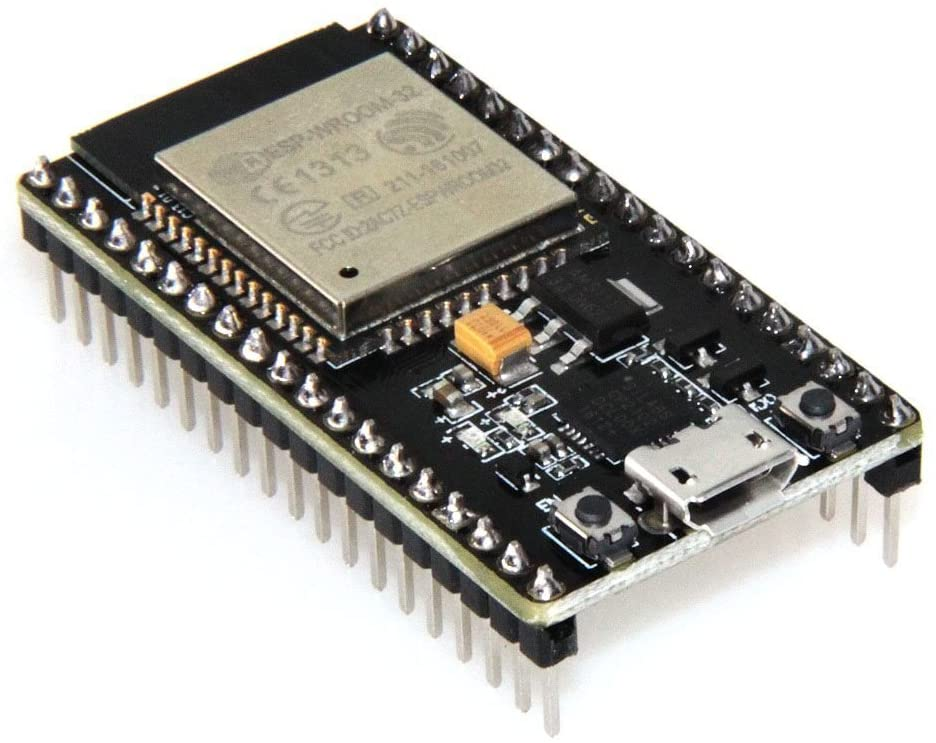
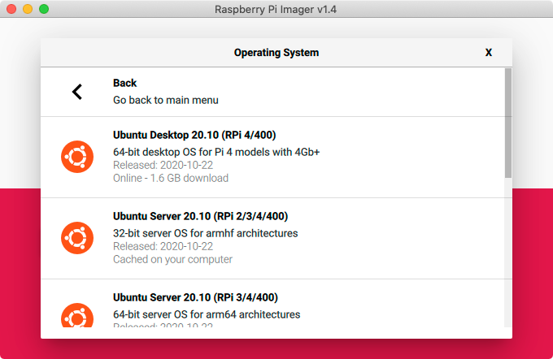

# How to install Ubuntu on Raspberry Pi for Go and TinyGo Software Development on ESP32 Microcontrollers 

This tutorial will walk you through how to setup [Ubuntu](https://ubuntu.com/download/raspberry-pi) 20.10 with Ubuntu Desktop on a [Raspberry Pi 4B](https://www.raspberrypi.org/products/raspberry-pi-4-model-b/), install the Espressif [ESP-IDF](https://docs.espressif.com/projects/esp-idf/en/latest/esp32/), install [Go](https://golang.org) and [TinyGo](https://tinygo.org) and finally flash an app to an Espressif [ESP32 Microcontroller](https://www.espressif.com/en/products/socs/esp32).

If you don't have an ESP32 you can get on on [Amazon](https://www.amazon.com/HiLetgo-ESP-WROOM-32-Development-Microcontroller-Integrated/) for about $10 with overnight shipping (at least in the Seattle area)



When I started out with this tutorial my plan was to install an ARM64 distribution on a Raspberry Pi as a development environment for TinyGo on ESP32. However what I have found so far is that running the ARM64 causes a bunch of problems. So for now I am going to stick with the Ubuntu ARM32 distribution.

One does seem to be able to use `dpkg --add-architecture armhf` to install ARM32 Bit and run ARM32 bit packages on an ARM64 Bit OS. Guess that is the Rosetta Stone for ARM64. [see also](https://askubuntu.com/questions/1217255/ubuntu-18-04-4-lts-64-bit-on-raspberry-pi-4-realvnc-server-how). I will do some more research on this next week.


Well, let's get started, the first thing to do is to get an SD card ready. To do so install the [Raspberry Pi Imager for MacOS](https://downloads.raspberrypi.org/imager/imager.dmg) or if you are a windows user you can download the [Raspberry Pi Imager for Windows](https://downloads.raspberrypi.org/imager/imager.exe) and there is also a [debian package](https://downloads.raspberrypi.org/imager/imager_amd64.deb).

The process to flash the SD card is pretty straightforward insert the card into your computer, run the app, select the OS, I will be using the Ubuntu Server 20.10 (RPI 2/3/4/400) 32-bit server OS image, chose the SD Card and click WRITE and Yes to flash the SD Card. 



This will download the image to your computer and flash it to the card. The image will be "cached" on your computer so that the next time it doesn't have to download the whole thing again.

The easiest way to move forward is to to hardwire your pi's network but WiFi will work too, it just needs a few extra steps. If you want to connect your Raspberry Pi to WiFi right now, once done flashing open up the SD Card and find a file called network-config. You will have to make a few changes to that file to enable your WiFi network.

Find the following lines:

```
#wifis:
#  wlan0:
#    dhcp4: true
#    optional: true
#    access-points:
#      myhomewifi:
#        password: "S3kr1t"
```

Remove the #'s from the beginning of the lines and update them with your WiFi network settings. It will look something like this when you are done:

```
wifis:
  wlan0:
    dhcp4: true
    optional: true
    access-points:
      TheBestWifiNetwork:
        password: "WithASuperStrongPassword"
```

Now eject the card from your computer, insert it in your Raspberry Pi and boot the thing up!

You'll see a login prompt asking for a username and password. The initial username/password is ubuntu/ubuntu. Login and the system will ask you to change the password.

The first thing we are going to do is get the latest updates installed. To do this run:

```
sudo apt update -y && sudo apt upgrade -y
sudo reboot
```

If you get an error here, you either set the wifi settings wrong in the in network-config or you need to reboot once. Run `sudo reboot` "fixes" the latter.

Now we are going to install the Ubuntu Desktop on the Raspberry Pi, to do so run:

```
sudo apt install tasksel
sudo reboot
sudo apt update -y && sudo apt upgrade -y
sudo reboot
sudo tasksel install ubuntu-desktop
sudo apt update -y && sudo apt upgrade -y
sudo reboot
```

That is a lot of updating and rebooting but in my experience that gives the best outcome! After that last reboot the Raspberry Pi will boot into the desktop GUI and ask you to login. In case your system isn't booting into the GUI run:

```
sudo systemctl set-default graphical.target
sudo reboot
```

After login answer a few questions to finish up this part of the installation. I like doing things from the command line but I also like a comfortable GUI. To make it a little more comfortable lets install a few things. 

First, click on the Menu button on the left bottom of the screen and the search bar type "Terminal", click on Terminal and when it opens right click on the terminal icon in the menu bar on the left of the screen and click "add to favorites". We are going to need Terminal a lot!

Ubuntu Desktop automatically installs the Canonical Snapd deamon to install software from Snap Craft -if you are not familiar with Snap Craft, check it out [here](snapcraft.io)- but it does not install the associated snap GUI app so we will do that next. In Terminal run:

```
sudo snap install snap-store
```

Now you can install software using the snap software store. One of my favorites to install right away is barrier. I have barrier installed on both my Mac and the Raspberry pi, it is basically a KVM that gives me the option to move my mouse to a screen on the "connected" computers and use one keyboard and mouse for both my Mac and the Raspberry pi!

Next we will install some software to edit the desktop a bit. You can edit some of the appearance by going to settings -> appearance but that is limit, I want to make some more changes. To do so I installed the d-cong editor. So in again in Terminal run:

```
sudo apt install dconf-editor
```

You can use this to make changes to the appearance of the desktop GUI. You could also use the command line for that by doing things like:

```
gsettings set org.gnome.shell.extensions.dash-to-dock extend-height false
settings set org.gnome.shell.extensions.dash-to-dock dock-position BOTTOM
settings set org.gnome.shell.extensions.dash-to-dock transparency-mode DYNAMIC
settings set org.gnome.shell.extensions.dash-to-dock dash-max-icon-size 30
gsettings set org.gnome.shell.extensions.dash-to-dock unity-backlit-items false
```

And we will install the Gnome Tweak tools:

```
sudo add-apt-repository universe
sudo apt install gnome-tweak-tool
sudo apt install gnome-shell-extension-disconnect-wifi
gnome-tweaks
```

This will install the tweak tool and start it for you, you can see there are some interesting things to tweak. It now is, for example, easy to add an app to autostart on login. I am auto starting "barrier" so I can connect more easily from my MAC.

Next , if you used Wifi to get this far, we will have to fix an issue with the wifi settings. As you will see the Ubuntu Desktop has a widget to configure the Wifi Network but right now due to the fact that we hard coded some wifi settings in earlier on, that is not work.

You can fix that by making some changes to `etc/netplan/50-cloud-init.yaml`. From that file remove the lines that were added for your wifi network and add `optional: true` to the eth0: config section.

```
sudo nano etc/netplan/50-cloud-init.yaml
```

It will open the file you need to edit, your file will have to look something like this when you are done:

```
#
# network: {config: disabled}
network:
    ethernets:
        eth0:
            dhcp4: true
            match:
                macaddress: ab:cd:ef:01:02:03
            set-name: eth0
        optional: true
    version: 2
```

After another `sudo reboot` you can now configure your wireless networks from the wireless network widget in Ubuntu Desktop!

YAY! have a working Ubuntu Desktop. Let's get some development tools setup shall we? First let's add some path settings:

```
echo 'export PATH="$PATH:$HOME/.local/bin"' >> ~/.profile
source ~/.profile
```

Next we are going to install a bunch of packages:

```
sudo apt-get install flex bison gperf gettext python3-setuptools cmake ninja-build ccache libssl-dev automake texinfo help2man libtool libtool-bin libbz2-dev libreadline-dev libsqlite3-dev llvm libncurses5-dev libncursesw5-dev tk-dev liblzma-dev chromium-browser
sudo apt update && sudo apt upgrade && sudo apt autoremove
sudo reboot
```

And let's install pip and some other tools:

```
pip install --upgrade pip
pip install numpy
pip install esptool adafruit-ampy rsa
```

Now let's get "Python Alternatives" setup, we are not really needing this right now but it makes life easier later on if you need to manage multiple versions of Python and for now it will make it so that you can just type `python` and not have to use `python3`, there is no python version 2 installed on this machine anyway.

You can read a little more about that [here](https://linuxconfig.org/ubuntu-20-04-python-version-switch-manager).

```
sudo update-alternatives --install /usr/bin/python python /usr/bin/python3 1
```

Now we are off to the races, lets get the ESP-IDF installed! I am going to install v4.2 you might want to install something else. If so check out the [Espressif website](https://docs.espressif.com/projects/esp-idf/en/v4.2/esp32/get-started/index.html#linux-and-macos) for more information.

```
mkdir ~/esp
cd ~/esp
git clone -b v4.2 --recursive https://github.com/espressif/esp-idf.git
cd ~/esp/esp-idf
./install.sh
```

You can go have a cup of coffee or probably eat a quick dinner, on a Raspberry Pi this is going to take a while. Once  ESP-IDF has been installed we need to run `. $HOME/esp/esp-idf/export.sh` to get it ready for use. However at the moment this seems to throw some errors. As we only need the ESP32 binaries for this project we are just going to set the path directly to it so we can use that later.

```
echo 'export PATH="$PATH:$HOME/.espressif/tools/xtensa-esp32-elf/esp-2020r3-8.4.0/xtensa-esp32-elf/bin"' >> ~/.profile
source ~/.profile
```

If it would have worked to run `export.sh`, to make it easier in the future set, an alias for this so the next time you can just type get_idf, again, presuming the errors resolved themselves.

```
echo 'alias get_idf=". $HOME/esp/esp-idf/export.sh"' >> ~/.profile
source ~/.profile
```

If you do that you can just type get_idf to make get ESP-IDF ready.

Let's change it up a little, let's use the snap store to install Go! on your Ubuntu Desktop open up software and search for Golang, click install and a few minutes later Go is installed on your Raspberry Pi! Now that seems to install Go however, when I did that, I ran into some issues later on. You might try it but your success might vary.

The alternative method isn't too much more difficult and will get you the latest version from Golang.org. To do that, do this:

```
cd ~/Downloads/
wget https://golang.org/dl/go1.15.6.linux-armv6l.tar.gz
sudo tar -C /usr/local -xzf go1.15.6.linux-armv6l.tar.gz
echo 'export PATH=$PATH:/usr/local/go/bin' >> ~/.profile
echo 'export GOPATH=$HOME/go' >> ~/.profile
source ~/.profile
```

In the example above used "go1.15.6.linux-armv6l" by the time you read this there might be a newer version so check the [Golang](https://golang.org) website for the latest and greatest.

Now we are going to install TinyGo! The Snap Store doesn't have it so we will install that manually too. Again I am using the latest version from the [TinyGo](https://tinygo.org) website for the latest ARM32 package.

```
cd ~/Downloads/
wget https://github.com/tinygo-org/tinygo/releases/download/v0.16.0/tinygo_0.16.0_arm.deb
sudo dpkg -i tinygo_0.16.0_arm.deb
```


Now we have both Go and TinyGo installed on our Raspberry Pi! Next we'll test this and see if we can flash a Go file to the ESP32. Let's create a little project setup.

```
mkdir -p ~/Projects/MyGoProjects/blinkblue
cd ~/Projects/MyGoProjects/blinkblue
```

There is an example in the TinyGoo examples directory but that doesn't work with the ESP32 board I am using but here is some code that will work with the majority of the ESP32 dev board I have come across. You might need to update the PIN number to represent the correct pin on your board.

```
wget https://github.com/cashoefman/Setup/blob/75024ed6e9259a515d704306ce259eb99b583765/Examples/blinkblue.go
```

Now we are ready to flash the go file to the board. We'll set the path to the ESP32 binaries first.

```
export PATH="$PATH:$HOME/.espressif/tools/xtensa-esp32-elf/esp-2020r3-8.4.0/xtensa-esp32-elf/bin"
```
Now connect your ESP32 to a USB port on your Raspberry Pi so we can figure out the port that it is connected to and set that value in the `SERIALPORT` variable.

```
ls /dev/ | grep -i "tty" | grep -i "usb"
export SERIALPORT="/dev/ttyUSB0"
```
You can test that this work by querying the board with:

```
esptool.py --port $SERIALPORT flash_id
```

If you get an error message you can not access the port you might have to do either one or both of these:

```
sudo usermod -a -G dialout $USER
sudo chmod a+rw /dev/ttyUSB0
```

And now.... we will flash the code to the ESP32. If all works out as planned the LED on your ESP32 will then start flashing!

```
tinygo flash -target=esp32 -port=$SERIALPORT blinkblue.go
```

[](https://www.youtube.com/watch?v=Oieaz4vurMY)

Finally there we are, we have a working Raspberry Pi with an up-to-date version of Ubuntu running on it to use as a development machine for TinyGo on ESP32 boards.
